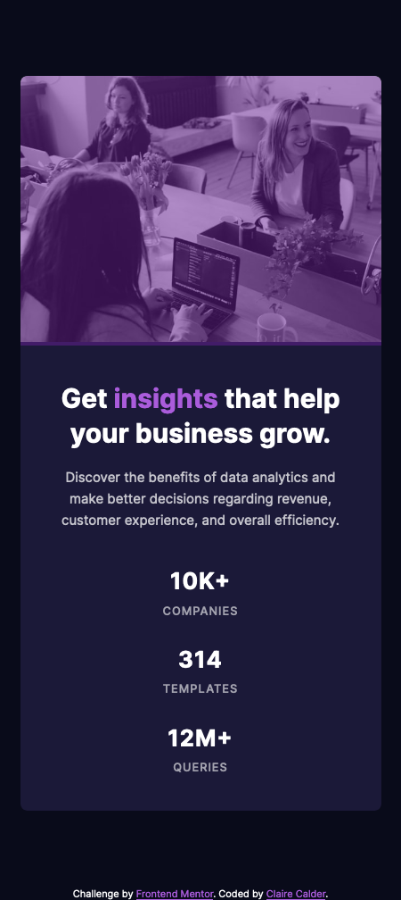
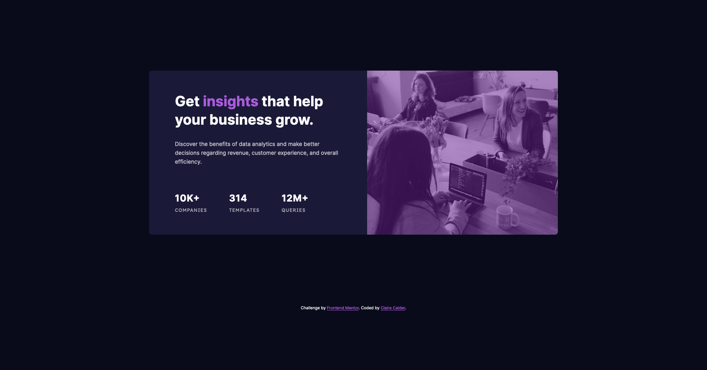

# Frontend Mentor - Stats preview card component solution

This is a solution to the [Stats preview card component challenge on Frontend Mentor](https://www.frontendmentor.io/challenges/stats-preview-card-component-8JqbgoU62). Frontend Mentor challenges help you improve your coding skills by building realistic projects. 

## Table of contents

- [Overview](#overview)
  - [The challenge](#the-challenge)
  - [Screenshot](#screenshot)
  - [Links](#links)
- [My process](#my-process)
  - [Built with](#built-with)
  - [What I learned](#what-i-learned)
  - [Continued development](#continued-development)
- [Author](#author)

## Overview

### The challenge

Users should be able to:

- View the optimal layout depending on their device's screen size

### Screenshot

- 

- 

### Links

- Solution URL: [Stats Preview Card Component - Mobile First, Flexbox and SASS](https://www.frontendmentor.io/solutions/stats-preview-card-component-mobile-first-flexbox-and-sass-vxXYE2a1h)
- Live Site URL: [Vercel URL](https://front-end-mentor-stats-preview-card.vercel.app/)

### Built with

- Semantic HTML5 markup
- SASS
- Flexbox
- Mobile-first workflow

### What I learned

During this challenge I used mix-blend-mode on my images for the first time.  It's a cool trick I'll be using in future projects to make my designs more visually appealing.  It allows you to tell the browser how you want one element to blend with the element that sits on top of it. I had a play around with all the different blend modes to see what they all looked like and I chose the one that made my image look as close to the design as I could get.  

Another new CSS feature I used for the first time during this challenge was the object-fit on my desktop image.  It's not something I had come across before, but its a great feature that gives you more control over how your images are resized - like the background-size for background-images does.   

### Continued development

I will be aiming to continue using mix-blend-mode and object-fit in future projects where possible as they are very useful tools to have in my kit.  I also now realise where I could have used these techniques in past projects, so I will at some point go and see if I can implement them in these.

## Author

- Frontend Mentor - [@claire-ca](https://www.frontendmentor.io/profile/claire-ca)